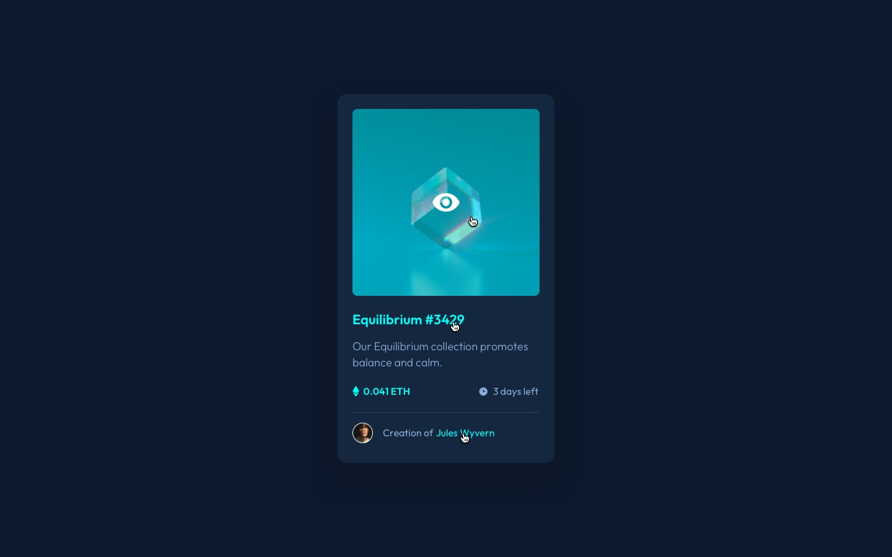

# Frontend Mentor - NFT preview card component solution

This is a solution to the [NFT preview card component challenge on Frontend Mentor](https://www.frontendmentor.io/challenges/nft-preview-card-component-SbdUL_w0U). Frontend Mentor challenges help you improve your coding skills by building realistic projects.

## Table of contents

- [Overview](#overview)
  - [The challenge](#the-challenge)
  - [Screenshots](#screenshots)
  - [Links](#links)
- [My process](#my-process)
  - [Built with](#built-with)
  - [What I learned](#what-i-learned)
  - [Continued development](#continued-development)
  - [Useful resources](#useful-resources)
- [Author](#author)

## Overview

### The challenge

Users should be able to:

- View the optimal layout depending on their device's screen size
- See hover states for interactive elements

### Screenshots

> Desktop Preview
> 

> Active States on Hover
> 

> Mobile preview
> 

### Links

- Live Site URL: [Add live site URL here](https://your-live-site-url.com)

## My process

### Built with

- Semantic HTML5 markup
- CSS custom properties
- Flexbox
- Media Queries

### What I learned

This project was very useful to recap a lot of things that I am studying as well to learn some others, especially about css and responsiveness. I was able to change the size using media queries only with a few lines thanks to some tips that I received about using rem.

```css
@media (max-width: 1366px) {
  :root {
    font-size: 42.5%;
}
```

Changing only the font size of the root element, the entire document scaled better on other screen sizes.

### Continued development

Building this one I was able to realize a lot of areas that I still lack of knowledge. I intend to continue perfecting my abilities on css and HTML to advance with frameworks. But I'm still not comfortable, so I'll probably continue to pratice only with pure HTML, CSS and JS.

### Useful resources

- [How To Create an Overlay Image Icon](https://www.w3schools.com/howto/howto_css_image_overlay_icon.asp) - This helped me to build the overlay on the equilibrium image. I was stuck for a long time before I found this and was able to continue with the development. I really liked this pattern and will use it going forward.

## Author

- Github - [William Firmino](https://github.com/Willwf)
- Frontend Mentor - [@Willwf](https://www.frontendmentor.io/profile/Willwf)
- Twitter - [@Williamwf](https://www.twitter.com/Williamwf)
- LinkedIn - [William Firmino](https://www.linkedin.com/in/williamfirmino/)
